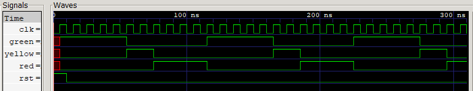
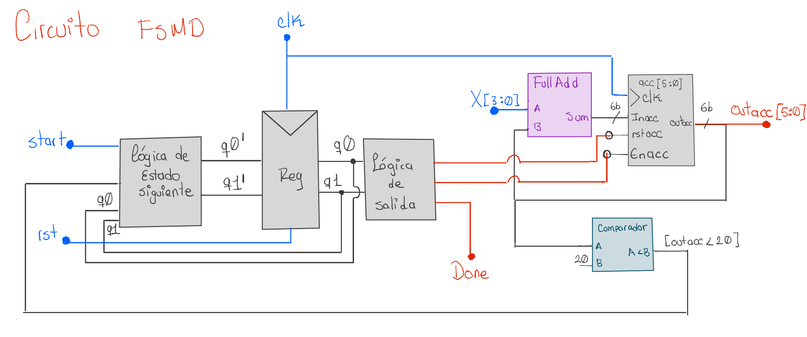
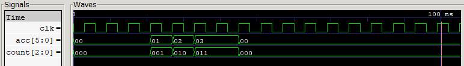
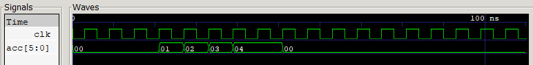
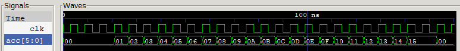

# Laboratorio 00: Introducción a Verilog, Simulación y Máquinas de Estados Finitos (FSM)
**Asignatura:** Electrónica Digital II  
**Semestre:** 2026-2  

---

##  Integrantes del Equipo
- **Samuel Hincapie Perilla**
- **Eduardo**
- **Gabriel Alberto Rodríguez Rincón**

---

##  Introducción y Entorno de Trabajo

Para el desarrollo de esta práctica se configuró un entorno de simulación ligero compuesto por:
- **Icarus Verilog (`iverilog`):** Compilador y simulador HDL.
- **GTKWave:** Visualizador de ondas en formato VCD (`.vcd`).
- **Visual Studio Code:** Editor de código base.

---

##  Ejercicio 1: FSM de Control – Semáforo Simple

### 1. Descripción del Diseño
Se implementó una Máquina de Estados Finitos (FSM) síncrona tipo Moore para controlar la secuencia cíclica de un semáforo vehicular de tres estados. 

El sistema cuenta con un contador interno que controla la permanencia en cada estado según la cantidad requerida de periodos de reloj ($T_{clk} = 10\text{ ns}$):
- **Estado $S_0$ (Verde):** Permanece 5 ciclos de reloj.
- **Estado $S_1$ (Amarillo):** Permanece 2 ciclos de reloj.
- **Estado $S_2$ (Rojo):** Permanece 4 ciclos de reloj.

Al completar el tiempo en el estado $S_2$, el sistema reinicia automáticamente el ciclo retornando al estado $S_0$.

### 2. Máquina de estados
---

### 3. Resultados de Simulación y Análisis (GTKWave)

Para la verificación se ejecutó el comando de compilación y visualización:
```bash
iverilog -o tb_semaforo.vvp semaforo.v tb_semaforo.v
vvp tb_semaforo.vvp
gtkwave semaforo.vcd
```
En la siguiente imágen se observa el resultado de la simulación en gtkwave.



## Ejercicio 2: Acumulador Secuencial

### 1. Descripción del Diseño
Se implementó un acumulador secuencial síncrono controlado por una FSM. El sistema recibe una entrada de 4 bits ($x$) y un pulso de inicio (`start`). La acumulación se ejecuta ciclo a ciclo hasta alcanzar la condición límite parametrizada.

* **Parámetros y Entradas:** 
  - Entradas: `clk`, `rst`, `start`, `x[3:0]`.
  - Salidas: `acc[5:0]` (acumulador de 6 bits), `done` (bandera de finalización).
* **Variante Seleccionada (`VARIANTE = 3`):** Acumular $x$ de manera iterativa hasta que la suma alcance o supere el valor de 20 (`acc >= 20`).

---

### 2. Máquina de Estados y Datapath

El sistema combina una unidad de control FSM y una ruta de datos:

* **`IDLE` (`2'b00`):** Estado de reposo. Al detectar `start = 1`, carga la primera entrada en `acc` (`acc <= x`), inicializa el contador (`count <= 1`) y pasa a `ADD`.
* **`ADD` (`2'b01`):** Suma incrementalmente `acc <= acc + x` en cada flanco de subida. Mantiene la iteración mientras `acc < 20`. Al evaluar `acc >= 20`, transiciona a `DONE`.
* **`DONE` (`2'b10`):** Emite la señal `done = 1` confirmando el fin del procesamiento y regresa a `IDLE`.
  

#### 2.1 Identificacion de entradas y salidas FSM + datapath

Para llevar a cabo el sistena, es necesario utilizar un registro que se encargue de guardar el valor que va acumulando `acc`, además de utilizar un sumador para realizar la operción respectiva. por otro lado, para las funciones de contar 3 y 4 veces se utilizará un contador que permita determinar el numero de cuenta realizada y por ultimo se usa un comparador para analizar el camino de datos.


#### 2.2 Construcción de la unidad de ccontrol FSM

Se muestra el diagrama de estados de la unidad de control, consta de 4 estados que controlan el datapath indetificado anterior mente para el caso numero 3 (acumula hasta 20), para simplificar la expresión de comparasion, en lugar de utilizar `acc >= 20`, se cambia por `acc < 20` manejando la lógica respectiva


#### 2.3 Conexiones FSMD
Se establecen las conexiones que unen la unidad de control con el camino de datos presentando el flujo de conexiones del circuito digital para realizar el caso 3 del ejercicio.


.

Nota: para los casos de contar 3 y 4 veces el numero `x` de la entrada se realiza un proceso similar utilizando el contador, para realizar un circuito con las tres funciones se utiliza un multiplexoor que permita seleccionar el tipo de funcion deseado.


### 3. Resultados de Simulación y Análisis (GTKWave)

Comandos ejecutados para la compilación y visualización:

```bash
iverilog -o acumulador.vvp acumulador.v tb_acumulador.v
vvp acumulador.vvp
gtkwave wave.vcd
```
Con el propósito de validar funcionalmente el comportamiento síncrono del acumulador y comprobar el correcto flujo de transiciones de la FSM, se ejecutó el entorno de simulación empleando Icarus Verilog y GTKWave. En la Figura se registran las formas de onda correspondientes a las señales principales del sistema (clk y acc ), donde se evidencia la acumulación progresiva en el tiempo.

Para el caso número 1:



Para el caso número 2:



Para el caso número 3:


